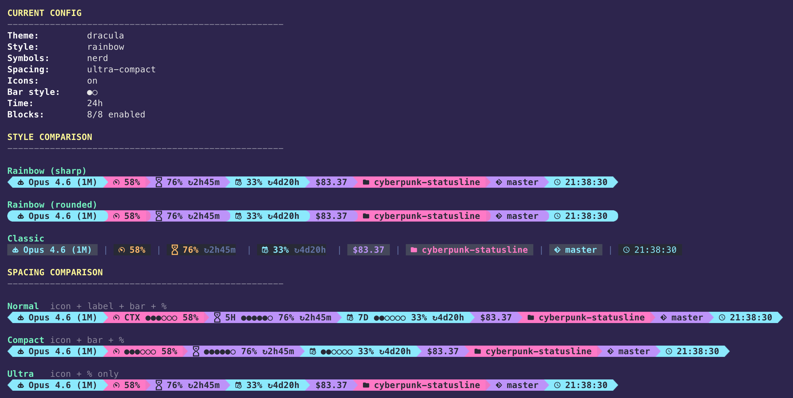

# cyberpunk-statusline

[English](README.md) | [繁體中文](docs/README.zh-TW.md)

Themeable cyberpunk status line for Claude Code, with a p10k-style setup wizard.

Displays model, context usage, rate limits, daily cost, directory, git branch, and time — all rendered in your terminal with true-color themes.



## Prerequisites

- **Claude Code** CLI or Desktop
- **jq** — `brew install jq` (macOS) / `apt install jq` (Linux)
- **Nerd Font** (optional, recommended) — for icons. [Download here](https://www.nerdfonts.com/)
- **ccusage** (optional) — for accurate daily cost tracking. `npm i -g ccusage`

## Installation

### 1. Clone

```bash
git clone https://github.com/0xaissr/claude-cyberpunk-statusline.git ~/claude-cyberpunk-statusline
```

### 2. Install

```bash
cd ~/claude-cyberpunk-statusline && ./install.sh
```

This will:
- Check prerequisites (jq)
- Configure Claude Code's statusLine setting
- Launch the setup wizard (if first time)

### 3. Restart

Restart your Claude Code session to see the status line.

### Reconfigure

```bash
cd ~/claude-cyberpunk-statusline && ./configure.sh
```

The setup wizard will guide you through:

1. **Font detection** — Nerd Font / Unicode / ASCII
2. **Blocks** — choose which info blocks to display
3. **Spacing & bar style** — ultra-compact, compact, or normal + progress bar shape (■□, ●○, ◆◇, etc.)
4. **Prompt style** — Rainbow (colored backgrounds) or Classic (separators)
5. **Separator / Head & Tail shapes** — customize segment appearance
6. **Time format** — 24h / 12h / no seconds
7. **Theme** — pick from 13 built-in themes with live preview

### Available Blocks

| Block | Description |
|---|---|
| model | Model name (e.g., Opus 4.6) |
| context | Context window usage % |
| rate_5h | 5-hour rate limit % |
| rate_7d | 7-day rate limit % |
| cost | Daily cost across all sessions |
| directory | Working directory |
| git | Git branch |
| time | Current time |

The **cost** block shows today's total spending across all Claude models and sessions. It uses [ccusage](https://github.com/ryoppippi/ccusage) for accurate tracking if installed, otherwise falls back to built-in JSONL calculation. Data is cached and refreshed every 5 minutes in the background.

### iTerm2 Tab Tinting (optional)

cyberpunk-statusline can tint your iTerm2 tab background based on Claude Code
session state (running / waiting / idle / error). Colors are pulled from your
chosen theme's palette, so switching theme retints tabs automatically. On every
state change the tab title is also set to `<emoji> <basename>` (🟢 running /
🟡 waiting / 🔵 idle / 🔴 error), so narrow tabs stay identifiable — the emoji
prefix doesn't fade on inactive tabs. Dim palette colors are automatically
boosted (each channel scaled so the brightest component hits 200) so iTerm2's
inactive-tab dimming doesn't wash them out.

Enable it via the configure wizard Step 8 — only visible when `$TERM_PROGRAM`
is `iTerm.app`. Selecting Enable writes 6 hooks into `~/.claude/settings.json`
(SessionStart / UserPromptSubmit / PreToolUse / Notification / Stop / SessionEnd)
and a symlink at `~/.claude/scripts/tab-state.sh`. A timestamped backup of
settings.json is created before any modification.

| State   | Default palette | Triggers                     |
|---------|-----------------|------------------------------|
| running | accent_1        | UserPromptSubmit, PreToolUse |
| waiting | warning         | Notification (+ attention)   |
| idle    | accent_3        | SessionStart, Stop           |
| error   | alert           | (reserved, not auto-fired)   |

**Palette options:** `accent_1` / `accent_2` / `accent_3` / `warning` / `alert` /
`dim` (all from the current theme), plus a special `none` meaning "leave the
tab at iTerm2's default colour (no tint)". Useful if you want idle tabs to
blend in with regular non-Claude tabs — select it during the wizard's idle
prompt.

**Plugin users:** after upgrading to a new cyberpunk-statusline version, rerun
`/cyberpunk-statusline configure` so the symlink points at the new plugin
cache directory.

To disable, rerun configure and choose Skip at Step 8 — hooks are removed
automatically. `./uninstall.sh` also tears them down.

### Preview & Edit Themes

```bash
# Preview all themes
cd ~/claude-cyberpunk-statusline && ./configure-theme.sh

# Edit a specific theme (interactive color editor with live preview)
cd ~/claude-cyberpunk-statusline && ./configure-theme.sh tokyo-night
```

### Update

```bash
cd ~/claude-cyberpunk-statusline && git pull
```

## Themes

| Theme | |
|---|---|
| blade-runner | catppuccin-mocha |
| dracula | gruvbox-dark |
| midnight-phantom | neon-classic |
| nord | one-dark |
| retrowave-chrome | rose-pine |
| synthwave-sunset | terminal-glitch |
| tokyo-night | |

You can also create custom themes — see `themes/custom-example/` for reference.

## Uninstall

```bash
cd ~/claude-cyberpunk-statusline && ./uninstall.sh
```

## License

MIT
