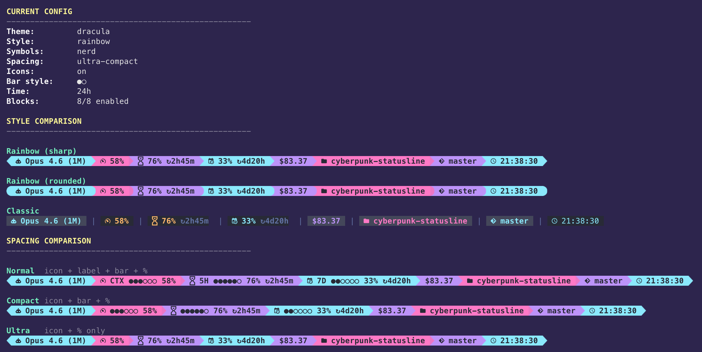

# cyberpunk-statusline

[English](README.md) | [繁體中文](docs/README.zh-TW.md)

Themeable cyberpunk status line for Claude Code and Codex, with p10k-style setup flows.

Displays model, context usage, rate limits, daily cost, directory, git branch, and time — all rendered in your terminal with true-color themes.



## Prerequisites

- **Claude Code** CLI or Desktop
- **jq** — `brew install jq` (macOS) / `apt install jq` (Linux)
- **Nerd Font** (optional, recommended) — for icons. [Download here](https://www.nerdfonts.com/)
- **ccusage** (optional) — for accurate daily cost tracking. `npm i -g ccusage`

## Installation

### 1. Clone

```bash
git clone https://github.com/0xaissr/claude-cyberpunk-statusline.git ~/claude-cyberpunk-statusline
```

### 2. Install Claude

```bash
cd ~/claude-cyberpunk-statusline && ./install-claude.sh
```

This will:
- Check prerequisites (jq)
- Configure Claude Code's statusLine setting
- Launch the setup wizard (if first time)

### Install Codex

Codex uses a separate installer so it can keep its own theme config:

```bash
cd ~/claude-cyberpunk-statusline && ./install-codex.sh
```

This will guide theme selection and configure Codex's official built-in
`tui.status_line` items. It does not build a patched Codex binary by default.
Official Codex does not currently support command-rendered cyberpunk status
lines.

For the full cyberpunk footer, opt into the patched-binary path explicitly:

```bash
cd ~/claude-cyberpunk-statusline && ./install-codex.sh --patched
```

### 3. Restart

Restart your Claude Code session to see the status line.

### Reconfigure

```bash
cd ~/claude-cyberpunk-statusline && ./configure.sh
```

The setup wizard will guide you through:

1. **Font detection** — Nerd Font / Unicode / ASCII
2. **Blocks** — choose which info blocks to display
3. **Spacing & bar style** — ultra-compact, compact, or normal + progress bar shape (■□, ●○, ◆◇, etc.)
4. **Prompt style** — Rainbow (colored backgrounds) or Classic (separators)
5. **Separator / Head & Tail shapes** — customize segment appearance
6. **Time format** — 24h / 12h / no seconds
7. **Theme** — pick from 13 built-in themes with live preview

### Available Blocks

| Block | Description |
|---|---|
| model | Model name (e.g., Opus 4.6) |
| context | Context window usage % |
| session | Cumulative tokens and cost for the current session (e.g. `646K $1.89`) |
| last_chat | Tokens and cost of the most recent API call (e.g. `163K $0.34`) |
| rate_5h | 5-hour rate limit % |
| rate_7d | 7-day rate limit % |
| spend | Monthly spend for Enterprise/quota accounts (replaces rate blocks) |
| credit | One-time Claude Code/Cowork credit usage for quota accounts (shown left of spend, when present) |
| cost | Daily cost across all sessions |
| burn | Daily burn rate shown as `actual <op> sustainable` (e.g. `87.6 > 0.8`) — your current %/day pace vs the %/day that would exactly last until reset. The operator (`>`/`<`/`=`) shows the relationship; `>` means you're on pace to run out early and turns alert-colored. Shows `--` until enough history accumulates. Backed by a per-render usage-history log (`~/.cache/cyberpunk-statusline/usage-history.jsonl`, deduped by (metric, value), 30-day retention; single-point outlier dips are ignored so a transient bad reading isn't mistaken for a reset). Early on the pace is noisy (extrapolated from little data) and settles as history fills out. |
| directory | Working directory |
| git | Git branch |
| time | Current time |

The **session** and **last_chat** blocks live on the second line by default. Both
count tokens the same way:

```
input_tokens + cache_creation_input_tokens + cache_read_input_tokens + output_tokens
```

`cache_read_input_tokens` **is included**. Every turn re-reads the whole context, so
this number grows roughly with `turns × context size` — it answers "how many billed
tokens has this session run through", not "how much context am I using right now"
(that's the `context` block). Cache reads account for roughly half the actual spend,
so excluding them would leave the token count and the dollar figure unable to
corroborate each other.

Cost is priced from the message's own `model` field, so switching models
mid-session is priced correctly. Cache writes are priced by TTL from
`usage.cache_creation` — 5-minute writes at 1.25× the input rate, 1-hour writes
at 2×.

Rates refresh themselves once a day. `core/fetch-pricing.sh` pulls the table
LiteLLM maintains (the same source `ccusage` reads, so both cost paths agree)
and caches it at `~/.cache/cyberpunk-statusline/pricing.json`. Anthropic
publishes no machine-readable price feed — `/v1/models` returns capabilities but
no rates — so a third-party table is the only option. The download runs detached
and the render path only reads the small cache, so a slow or missing network
never stalls the prompt; on any failure the built-in per-family table
(Fable / Opus / Sonnet / Haiku) takes over. A test reconciles that built-in
table against upstream so the fallback can't quietly go stale.

The dollar figure is the **equivalent API cost**. On a Pro/Max subscription you
are not billed per token, so treat it as a usage gauge rather than a bill.

Configure which blocks appear on each line with `blocks` and `blocks_line2`:

```json
"blocks":       ["model", "context", "rate_5h", "rate_7d", "cost"],
"blocks_line2": ["session", "last_chat"]
```

An empty or absent `blocks_line2` means no second line. Upgrading from an older
version: a `"tokens"` entry in `blocks` is treated as `"session"`, but you'll need to
re-run `configure.sh` to get the second line. Because cache reads are now counted,
the number you're used to seeing will jump substantially — often by more than an
order of magnitude (one real transcript went from 164,018 to 6,182,840, a ~38x
increase) — this is expected, not a bug. This feature no longer reads or writes the
cache files that the old `~/.claude/hooks/show-turn-usage.sh` Stop hook produced, so
if you still have that hook installed you can safely delete it.

On Codex, `session` behaves differently: it stays on the first line (Codex's status
line is single-line, so there is no second line to move it to), it shows tokens with
no `$` amount (Codex has no session-level cost source), and `last_chat` does not
exist at all on Codex.

Numbers are formatted `842` / `840K` / `12.4M` and always round down, so a value never
spills into the next unit. The count comes from the session transcript and is cached
against the transcript's mtime, so an idle statusline costs nothing to re-render.
It shows `--` when the transcript cannot be located.

The **cost** block shows today's total spending across all Claude models and sessions. It uses [ccusage](https://github.com/ryoppippi/ccusage) for accurate tracking if installed, otherwise falls back to built-in JSONL calculation. Data is cached and refreshed every 5 minutes in the background.

#### Enterprise / Quota Account: Spend Block

When the statusline detects an **Enterprise or quota-based Claude account** (i.e. no personal rate limits exist), the `rate_5h` and `rate_7d` blocks are automatically replaced with a **spend block** showing monthly usage:

```
$122/$500 24% ↻21d0h
```

- **`$used/$limit`** — amount spent this month vs. your quota limit
- **`pct%`** — percentage of quota consumed
- **`↻…`** — countdown until the quota resets (1st of next month)

If `account_type` is forced to `quota` but the usage data cannot be fetched, the spend block displays `$--`. In the default `auto` mode a fetch failure is treated as an unknown account, so the rate blocks are kept instead. Either way the statusline never blocks.

Data is fetched via the same usage endpoint that Claude Code itself uses. The script reads only your **local OAuth credentials** to query your own usage — no data is sent to any third party. Results are cached for 60 seconds and refreshed in the background.

#### One-time Credit Block

When a quota-based account has a **one-time Claude Code / Cowork credit** (the `cinder_cove` field — shown as "Claude Code and Cowork credit / Included credit" in the web UI), a `CR` block appears immediately to the **left of the spend block**:

```
CR ████░ 8% ↻89d  $122/$500 ████░ 24% ↻21d
```

- **`pct%`** — percentage of the one-time credit consumed (only a percentage is available; no dollar amount is exposed for this credit type)
- **progress bar** — same style as the `rate_5h` / `rate_7d` bars
- **`↻…`** — countdown until the credit expires

The credit block is **automatically hidden** when the account has no such credit, or once the credit is **fully used up (100%)** — at that point only the enterprise spend limit block remains, and the burn block switches to tracking spend. No configuration needed. It appears only for quota-based accounts; subscription accounts are unaffected.

#### `account_type` Setting

You can override the automatic detection with the `account_type` option in `config.json`:

| Value | Behavior |
|---|---|
| `auto` (default) | Detect account type automatically; show spend block for Enterprise/quota accounts, rate blocks otherwise |
| `subscription` | Force-show `rate_5h` / `rate_7d` blocks (personal Pro/Max plan) |
| `quota` | Force-show spend block (Enterprise/quota plan) |

### Preview & Edit Themes

```bash
# Preview all themes
cd ~/claude-cyberpunk-statusline && ./configure-theme.sh

# Edit a specific theme (interactive color editor with live preview)
cd ~/claude-cyberpunk-statusline && ./configure-theme.sh tokyo-night
```

### Update

```bash
cd ~/claude-cyberpunk-statusline && git pull
```

## Themes

| Theme | |
|---|---|
| blade-runner | catppuccin-mocha |
| dracula | gruvbox-dark |
| midnight-phantom | neon-classic |
| nord | one-dark |
| retrowave-chrome | rose-pine |
| synthwave-sunset | terminal-glitch |
| tokyo-night | |

You can also create custom themes — see `themes/custom-example/` for reference.

## Uninstall

```bash
cd ~/claude-cyberpunk-statusline && ./uninstall.sh
```

## License

MIT
